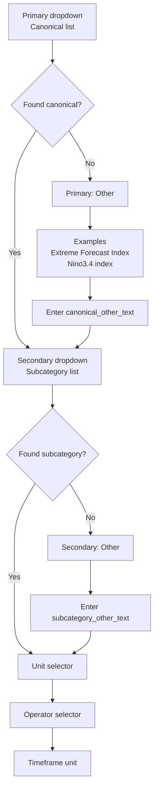
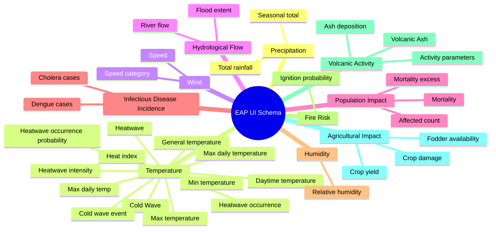

# UI Schema Designer Map

## Snapshot
| Metric | Value |
|---|---|
| Total documents | 62 |
| Total statements | 93 |
| Total thresholds | 253 |
| Failed records | 17 |
| Primary canonical forecast variables | 10 |
| Advanced search variables | 2 |
| Timeframe units | days, hours, months, weeks |

## UI Interaction Flow

## Fallback Logic for Other (Primary + Secondary)
| UI field | Option to include | If selected | Data captured |
|---|---|---|---|
| Primary canonical | Other | Show examples (Extreme Forecast Index, Nino3.4 index) and text input | canonical_other_text |
| Secondary subcategory | Other | Show text input for manual subcategory entry | subcategory_other_text |

Notes:
- Keep the existing mapped options first, then append Other as the last option.
- User path is always: Primary -> Secondary -> Unit -> Operator -> Timeframe.
- If Primary = Other, continue to Secondary as usual.
- If Secondary = Other, continue to Unit/Operator/Timeframe as usual.
- For Other entries, keep units/operators selectable so the user can fully define the threshold.

## Full Canonical -> Subcategory Map 

## Readable Canonical Reference (Complete)

### Precipitation (2)
- Seasonal total
- Total rainfall

### Temperature (13)
- Cold Wave
- Cold wave event
- Daytime temperature
- General temperature
- Heat index
- Heatwave
- Heatwave intensity
- Heatwave occurrence
- Heatwave occurrence probability
- Max daily temp
- Max daily temperature
- Max temperature
- Min temperature

### Wind (2)
- Speed
- Speed category

### Hydrological Flow (2)
- Flood extent
- River flow

### Population Impact (3)
- Affected count
- Mortality
- Mortality excess

### Infectious Disease Incidence (2)
- Cholera cases
- Dengue cases

### Humidity (1)
- Relative humidity

### Fire Risk (1)
- Ignition probability

### Volcanic Activity (3)
- Activity parameters
- Ash deposition
- Volcanic Ash

### Agricultural Impact (3)
- Crop damage
- Crop yield
- Fodder availability

## Default Constraints by Canonical
| Canonical variable | Default units | Default operators |
|---|---|---|
| Precipitation | %, counties, days, event, mm, mm/day, months, percentile, regions, tercile, years | <, <=, =, >, >=, between |
| Temperature | %, days, degrees, event, percentile, °C | <, <=, =, >, >= |
| Wind | %, Signal level, category, km/h, km/hr, knots, signal level | =, >, >= |
| Hydrological Flow | %, cm, cusecs, days, level, levels, m, metres, people, unitless, years | >, >= |
| Population Impact | %, IPC phase, index, months, people, tercile | <=, >, >=, between |
| Infectious Disease Incidence | %, cases, times average caseload | >, >= |
| Humidity | % | <, >= |
| Fire Risk | % | >= |
| Volcanic Activity | level, mm, units | >= |
| Agricultural Impact | % | >, >= |

## Advanced Search Variables
- Extreme Forecast Index
- Nino3.4 index

## Design Handoff Rules
1. Primary dropdown first shows canonical variables and appends Other.
2. If Primary = Other, show examples (Extreme Forecast Index, Nino3.4 index) and canonical_other_text input.
3. Secondary dropdown is then shown and appends Other.
4. If Secondary = Other, show subcategory_other_text input.
5. After Secondary, flow continues as usual to Unit, Operator, and Timeframe.
6. Unit and operator defaults come from canonical maps.
7. If a known subcategory is selected, apply subcategory override maps for unit/operator.
8. Timeframe unit is constrained to days, hours, months, weeks.
